## [This Whole Project is for Dennis Hackthon](https://www.youtube.com/watch?v=dItWfsngLJs&t=3161s)

Idea is from Meet. When first time I tried to Schedule Meeting in Google Meet it was little Hard for me. So the opportunity here comes for me, Quick Meet is Simple & Fast to use Application. Easy to interact with it as Password Less Login/Sign Up. Schedule meeting just by selecting 3 Options Quick & Easy to use for everyone.

## Features:
(Important Feature 5 mint Dialog will pop at the end of time then automatically end that meeting time over just 5 mint extended time)
1. Meeting expiring, before start meeting handled, at end time 5 mint dialog open.
2. Password Less Login & SignUp
3. Full Authenticated & Authorize
4. Backend with Harper DB
5. Multple user can join the video meeting and chat with each other, Switch Camera
6. Deployed on Secure Servers
7. Double Tap to Full Screen
8. Smooth & Quick to use interface
9. Click on any user video it will come on Stage or Big Screen
10. The Switch Camera will be available if Device has more than one camera and video is turned on by user
12. Fully Responsive
13. Token will Renew During Meeting if expiring using token_expiring agora events

## Important Note:
> As Backend In Heroku if there is no interaction with Backend then it will go in Idle State, So for first user meeting joining and creation it will be slow because services starting in backend but then it will work Smoothly. 35 Seconds Delay in Token generator and api Call first one only for first user. 

 

## LIVE URL'S 
> Frontend WEBSITE LIVE => 'http://quickmeet.netlify.app'  
> Backend API'S => 'https://quick-chat-api.herokuapp.com',  
> Agora Token Generator => 'https://go-agora-server.herokuapp.com'

 

## Tech Used
> 1 Frontend using Angular and Backend Using Spring Boot and Styling using Custom CSS & Ng Bootstrap.  
> 2 Agora for Video Call & Chat and Data Base used as Harper DB. 
> 3 For Security & Password Less Authentication & Authoriztation using Frontegg.  
> 4 Token Generator using Go Language

 

## Demo Images 

* Home Page  
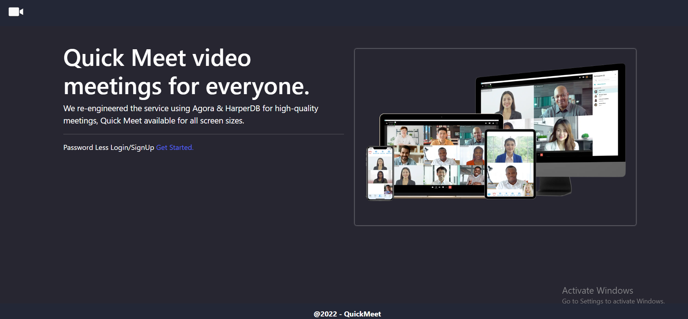

* Password Less Sign In
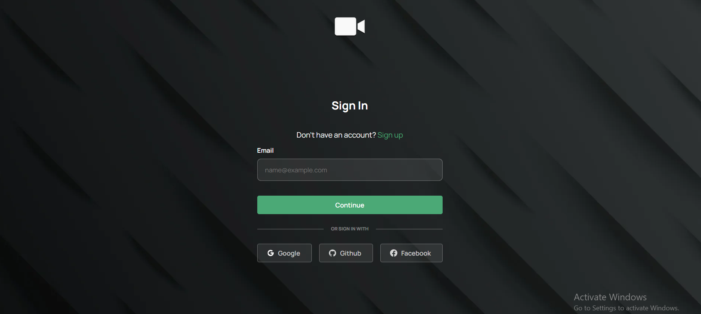

* Password Less SignUp
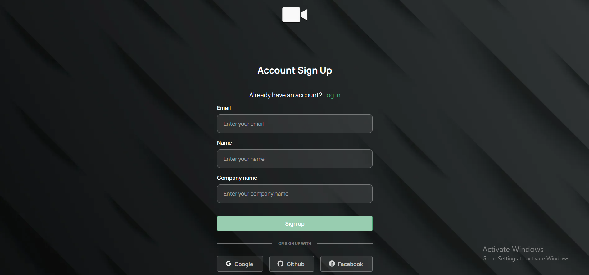

* Dashboard
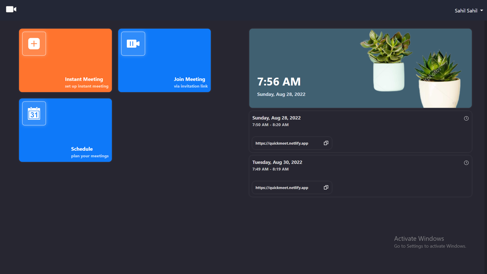

* Profile
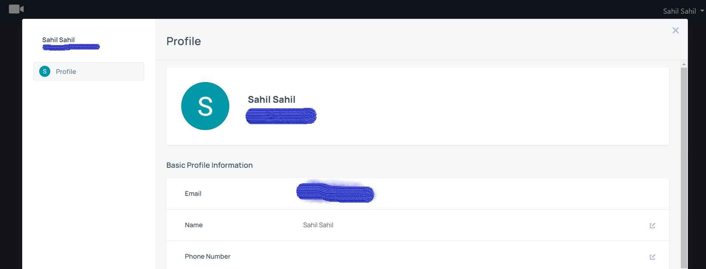

* Join Meeting
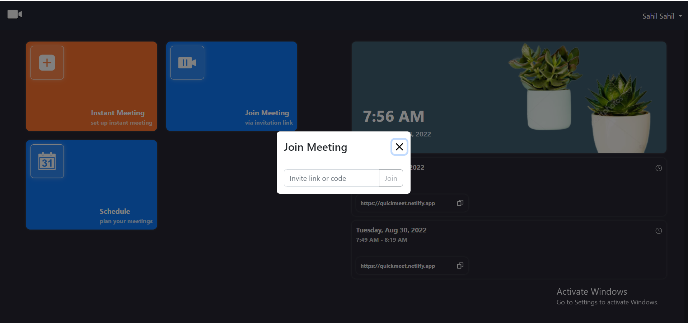

* Schedule Meeeting
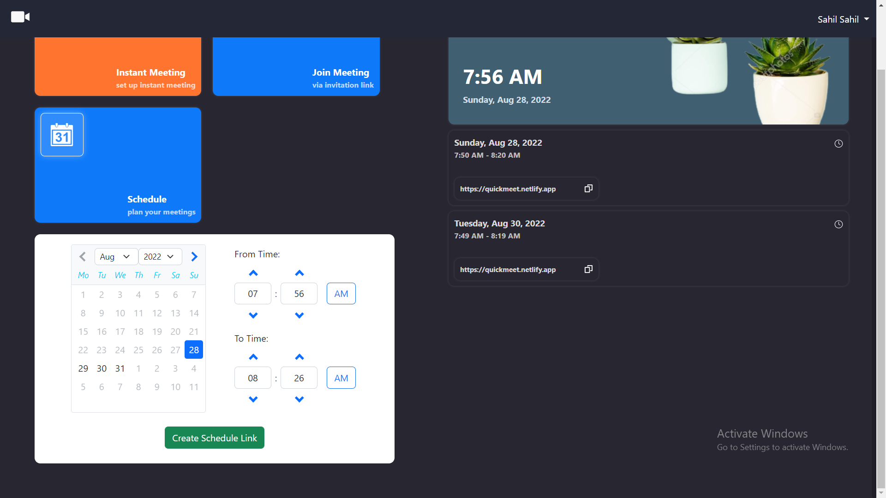

* Simple Chat & Private Chat
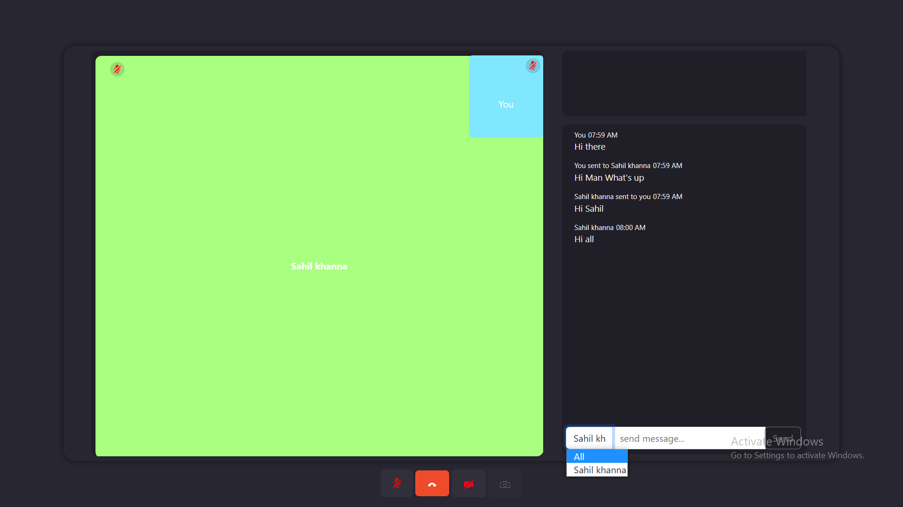

* Multiple User Video Call
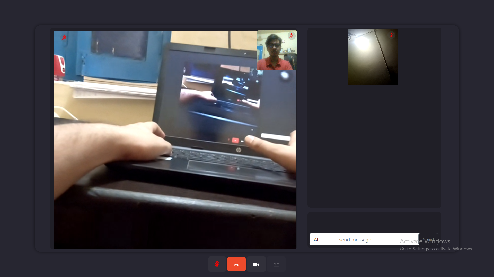

* Toast When User Join or Left
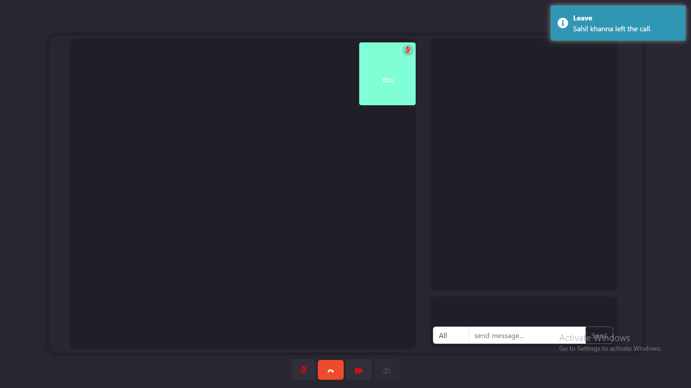

* End Time final extend of 5 mint
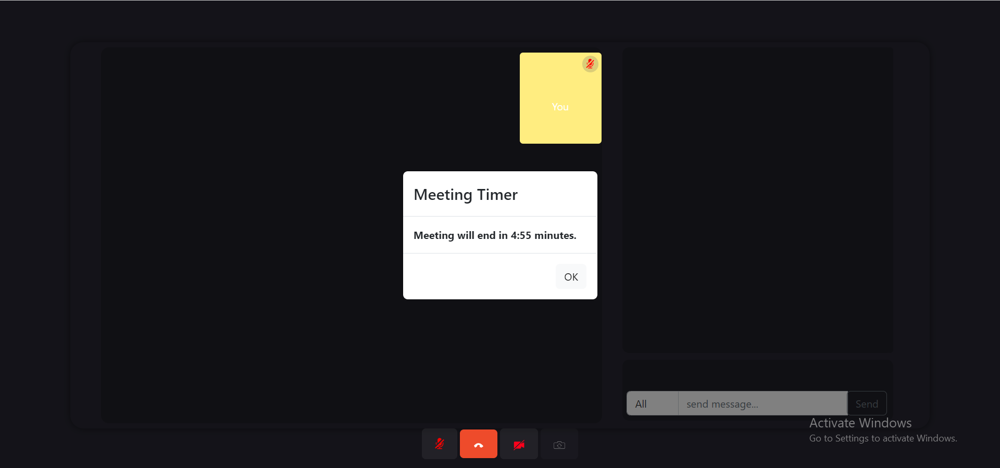

* Responsive Images
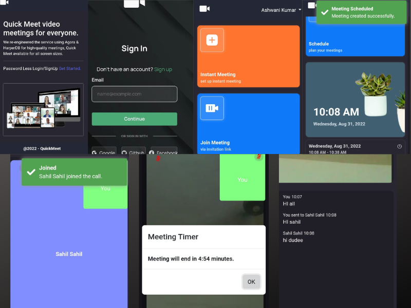

